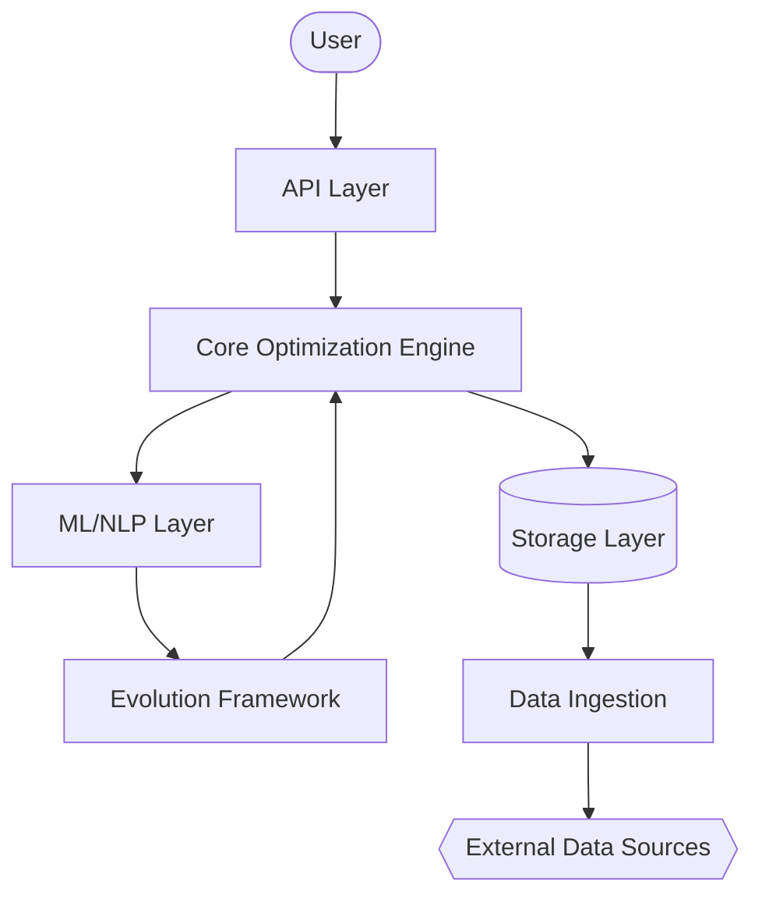

# Architecture

## System Shape

The acquisition platform is a layered optimization engine. External data sources feed into an ingestion layer, which normalizes and validates data before storage. The core optimization engine reads from storage, applies NP-hard problem solvers, and outputs results through an API layer to the user interface. An evolution framework continuously optimizes hyperparameters across all modules.

## Components

- **External Data Sources** — Crunchbase, PitchBook, Flippa, Acquire.com, Empire Flippers, Quiet Light, FE International. See [`entity_resolution.py`](modules/entity_resolution.md) for entity deduplication across sources.
- **Data Ingestion Layer** — Web crawlers, API clients, file upload, manual entry. Normalizes and validates incoming data.
- **Storage Layer** — Neo4j graph DB (relationships), Snowflake DW (analytics), Redis cache (hot data), Virtual Data Room (deal documents).
- **Core Optimization Engine** — 8 NP-hard solvers: matching, valuation, fraud detection, portfolio optimization, dynamic pricing, entity resolution, search ranking, evolution. See module docs for details.
- **ML/NLP Layer** — GNN matcher, learning-to-rank, NLP entity extraction, ensemble valuator, XGBoost fraud detector, LLM advisor.
- **Evolution & Evaluation** — Benchmark suite, genetic algorithm engine, evaluation framework, hyperparameter optimizer. See [`evolution.py`](modules/evolution.md).
- **API Layer** — REST API, MCP server, WebSocket.
- **User Interface** — Dashboard, search interface, deal room, analytics.

## System Diagram

## Data Flow

1. **Ingestion** — Data arrives from Crunchbase, PitchBook, Flippa, and other sources via APIs, web scraping, file upload, or manual entry.
2. **Processing** — Data is normalized, entity-resolved (deduplication), validated, and enriched. See [`entity_resolution.py`](modules/entity_resolution.md).
3. **Storage** — Processed data is stored in Neo4j (graph relationships), Snowflake (analytics), Redis (cache), and VDR (deal documents).
4. **Analytics** — Core solvers run: valuation, matching, fraud detection, portfolio optimization, pricing, search ranking. See module docs.
5. **Output** — Results are delivered as recommendations, alerts, reports, and deals through the API layer.

## Key Design Decisions

- **Modular NP-hard solvers** — Each problem domain is an independent module with its own algorithm, making it easy to swap approximations or add exact solvers.
- **TDD throughout** — Every module has tests written before implementation (RED-GREEN-REFACTOR).
- **Greedy approximations** — All NP-hard problems use polynomial-time greedy approximations rather than exact exponential-time solvers, enabling real-time performance.
- **Evolution framework** — A genetic algorithm engine optimizes hyperparameters across all modules, with benchmark-based evaluation.
- **Dataclasses for all data types** — Type-safe, immutable data structures with minimal boilerplate.
