# Class Diagram

## Core Types

```mermaid
classDiagram
    class Buyer {
        +str id
        +float budget
        +dict preferences
    }
    class Seller {
        +str id
        +float asking_price
        +dict attributes
    }
    class Match {
        +str buyer_id
        +str seller_id
        +float score
        +float confidence
    }
    class ValuationResult {
        +float value
        +str method
        +float confidence
        +float low_estimate
        +float high_estimate
    }
    class FraudSignal {
        +str name
        +float value
    }
    class FraudScore {
        +float score
        +str risk_level
        +float confidence
        +list~str~ explanations
    }
    class Asset {
        +str id
        +float cost
        +float expected_return
        +float risk
        +str sector
    }
    class Portfolio {
        +list~Asset~ assets
        +float expected_return
        +float sharpe_ratio
    }
    class PriceRecommendation {
        +float recommended_price
        +float confidence
        +float floor_price
        +float ceiling_price
        +float equilibrium_price
    }
    class EntityCluster {
        +list~dict~ entities
        +str canonical_name
    }
    class Listing {
        +str id
        +str title
        +float relevance
        +str category
    }
    class RankedListing {
        +str id
        +str title
        +float score
        +str category
    }
    class Benchmark {
        +str name
        +float target
        +evaluate(actual) EvaluationResult
    }
    class EvolutionResult {
        +float best_fitness
        +int generation_count
        +int population_size
        +float diversity
        +int offspring_count
        +bool converged
        +float worst_fitness
    }

    Buyer --> Match : matched to
    Seller --> Match : matched to
    Asset --> Portfolio : contained in
    Listing --> RankedListing : ranked as
```

## Notes

- All data types are Python dataclasses (immutable by default)
- `FraudScore` has an optional `GraphAnalysis` subclass with `has_ring` and `risk_score` fields
- `EvaluationResult` is returned by `Benchmark.evaluate()`
- `EvolutionResult` is returned by `EvolutionEngine.evolve()`
