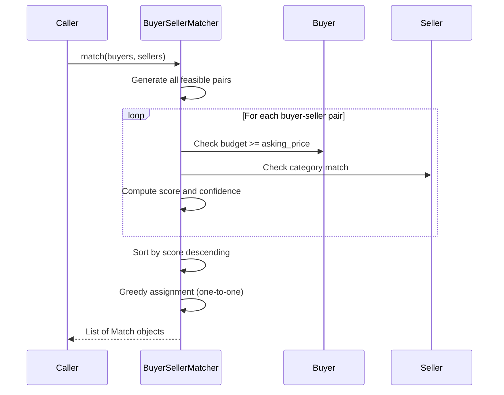
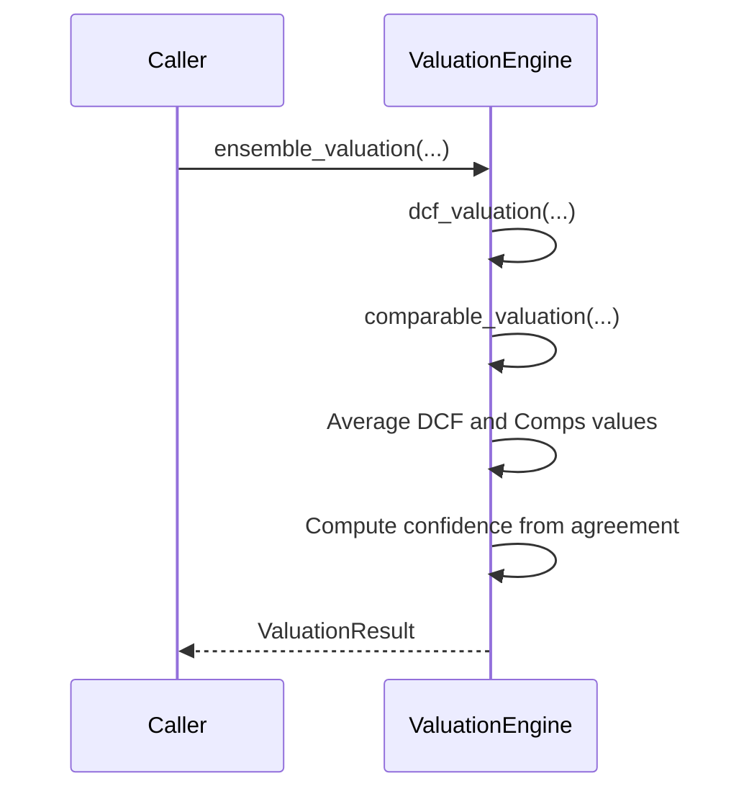
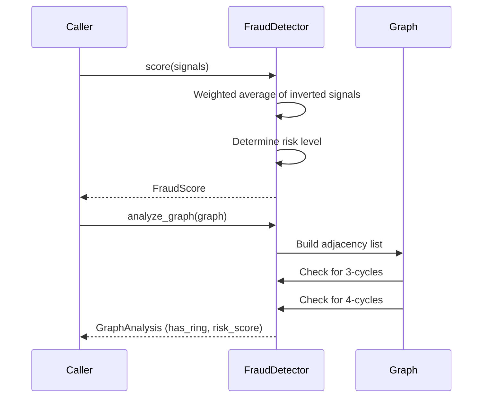
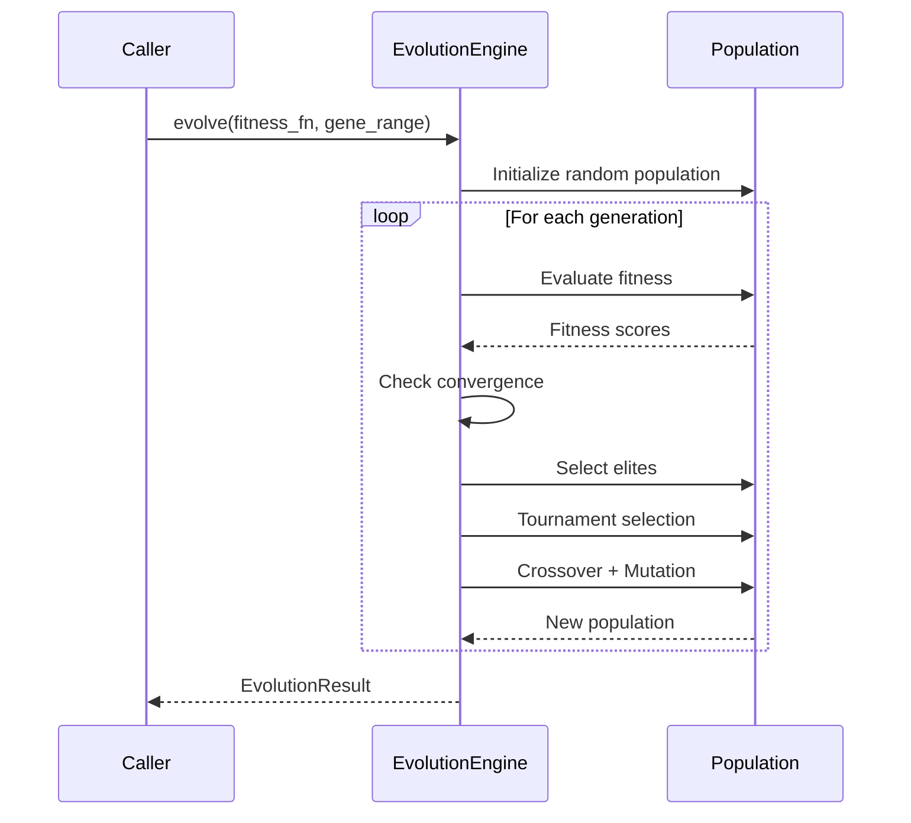

# Sequence Diagrams

## Workflow: Buyer-Seller Matching

```mermaid
sequenceDiagram
    participant Caller
    participant Matcher as BuyerSellerMatcher
    participant Buyer
    participant Seller

    Caller->>Matcher: match(buyers, sellers)
    Matcher->>Matcher: Generate all feasible pairs
    loop For each buyer-seller pair
        Matcher->>Buyer: Check budget >= asking_price
        Matcher->>Seller: Check category match
        Matcher->>Matcher: Compute score and confidence
    end
    Matcher->>Matcher: Sort by score descending
    Matcher->>Matcher: Greedy assignment (one-to-one)
    Matcher-->>Caller: List of Match objects
```

## Workflow: Valuation Ensemble

```mermaid
sequenceDiagram
    participant Caller
    participant Engine as ValuationEngine

    Caller->>Engine: ensemble_valuation(...)
    Engine->>Engine: dcf_valuation(...)
    Engine->>Engine: comparable_valuation(...)
    Engine->>Engine: Average DCF and Comps values
    Engine->>Engine: Compute confidence from agreement
    Engine-->>Caller: ValuationResult
```

## Workflow: Fraud Detection with Graph Analysis

```mermaid
sequenceDiagram
    participant Caller
    participant Detector as FraudDetector
    participant Graph

    Caller->>Detector: score(signals)
    Detector->>Detector: Weighted average of inverted signals
    Detector->>Detector: Determine risk level
    Detector-->>Caller: FraudScore

    Caller->>Detector: analyze_graph(graph)
    Detector->>Graph: Build adjacency list
    Graph->>Detector: Check for 3-cycles
    Graph->>Detector: Check for 4-cycles
    Detector-->>Caller: GraphAnalysis (has_ring, risk_score)
```

## Workflow: Evolution Optimization

```mermaid
sequenceDiagram
    participant Caller
    participant Engine as EvolutionEngine
    participant Population

    Caller->>Engine: evolve(fitness_fn, gene_range)
    Engine->>Population: Initialize random population
    loop For each generation
        Engine->>Population: Evaluate fitness
        Population-->>Engine: Fitness scores
        Engine->>Engine: Check convergence
        Engine->>Population: Select elites
        Engine->>Population: Tournament selection
        Engine->>Population: Crossover + Mutation
        Population-->>Engine: New population
    end
    Engine-->>Caller: EvolutionResult
```
